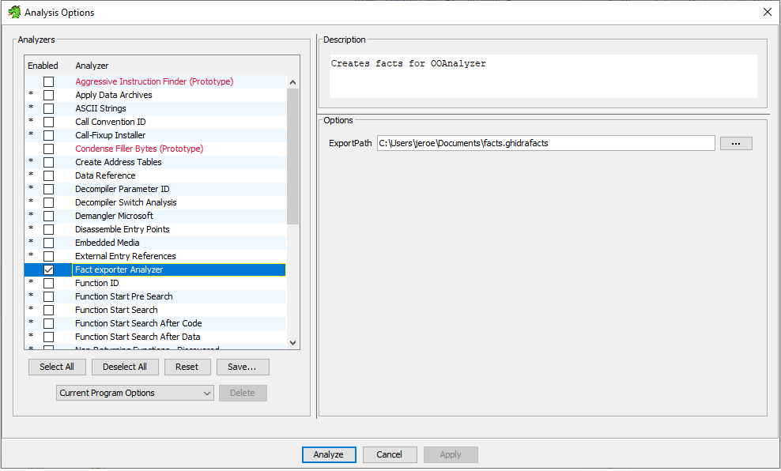

# Factexporter analyzer in Ghidra for OOAnalyzer

This factexporter is used to explore if the decompilation capabilities of Ghidra can improve the decompilation results of object
oriented constructs in [OOAnalyzer](https://github.com/cmu-sei/pharos/blob/master/tools/ooanalyzer/ooanalyzer.pod).

The factexporter was created for a research that tries to improve the decompilation of C++ code. 
The research was done at the *Open Universiteit* in the Netherlands.

The main contributor is [Jeroen van der Zwam](https://github.com/jeroenvanderzwam).

## Installation

The factexporter analyzer is run inside the [Ghidra](https://ghidra-sre.org/) framework.
To install Ghidra, Ghidradev plugin and the factexporter analyzer follow the [Ghidra installation guide](https://ghidra-sre.org/InstallationGuide.html). For convenience it is also possible to import the analyzer with the provided [zip file](ghidra_11.0_PUBLIC_20240312_FactExporter.zip). For how to install extensions in Ghidra see the [Ghidra extension installation guide](https://ghidra-sre.org/InstallationGuide.html#Extensions). Or you can build the analyzer yourself with Eclipse. For that you need the [GhidraDev](https://ghidra-sre.org/InstallationGuide.html#Development) plugin within Eclipse.

To run the analyzer you can open Ghidra, import the analyzer and run the analyzer on a binary.
Only Windows x64 and x86 binaries are tested, for now.

## Usage

After installation the fact exporter analyzer is available in the Analysis Options. When in Ghidra go to Analysis -> Analyze All Open and make sure you see the fact exporter analyzer.

To use the analyzer load your binary of choice, make sure the fact exporter analyzer is selected and run the analysis.

The binaries in the folders 32bit/binaries and 64bit/binaries are used for this research. The ground truths are located in 32bit/ground truths and 64bit/ground truths.

## Configuration

The option ExportPath enables you to export the facts to a location of your choice.
